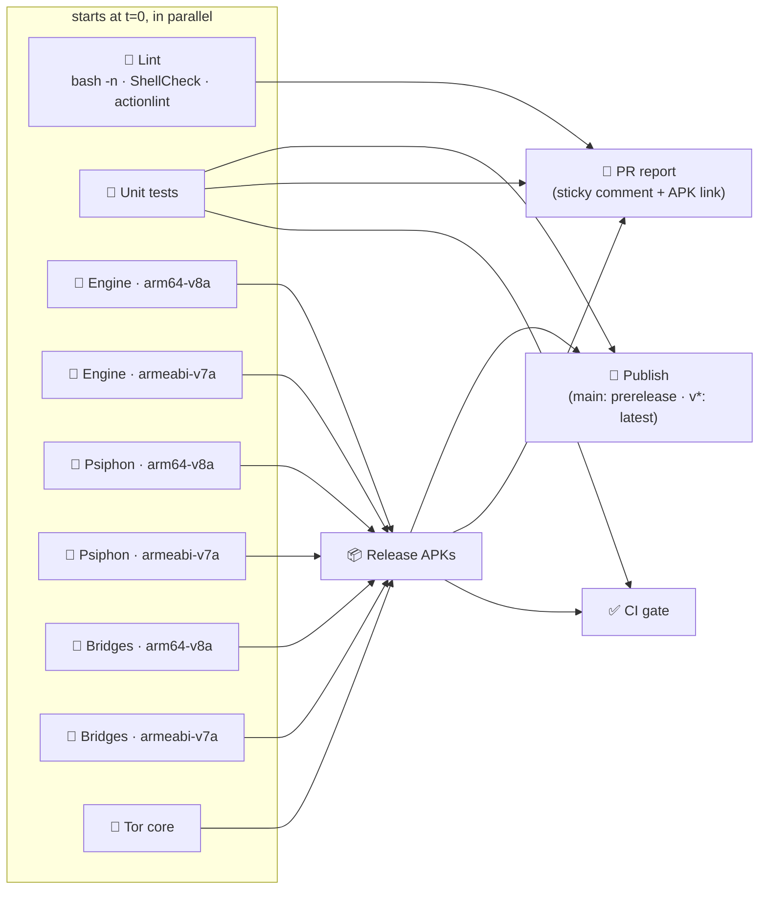

# CI / build pipeline

`.github/workflows/build.yml` is a fan-out / fan-in graph. Every native
component is its own job with its own cache, and both ABIs build side by side.

## What each job caches

| Job | Cache key is built from | Rebuilds when… |
|---|---|---|
| 🦀 Engine (per ABI) | `build-natives.sh`, `fetch-natives.sh`, `aethertun-jni.c`, `native/aether/**`, NDK, API, cargo-ndk | the engine, hev pin or JNI bridge changes |
| 🐹 Psiphon (per ABI) | `build-overlay-cores.sh`, NDK, API, Go | the Psiphon build script changes |
| 🐹 Bridges (per ABI) | `build-pt-transports.sh`, NDK, API, Go | a transport pin changes |
| 🧅 Tor | `build-overlay-cores.sh` | the tor-android version changes |

A cache is saved **only** by a run that built the component and verified it
complete, so a partial payload can never be restored. On a miss, Rust goes
through sccache and Go through a module/build cache, so even a rebuild only
recompiles what changed.

To force a clean native rebuild: **Actions → Build → Run workflow →
"Ignore every native cache"**.

## What blocks what

| Missing | Branch / PR | `v*` tag |
|---|---|---|
| Engine, hev, JNI bridge | ❌ fails | ❌ fails |
| Psiphon, tor, pluggable transports, Psiphon server list | ⚠️ warning, APK still built | ❌ fails |
| geoip | ➖ note | ➖ note |
| Lint findings | 🔴 lint job only (advisory) | 🔴 lint job only (advisory) |

For branch protection, mark **✅ CI gate** as the single required check.

## Local builds

Nothing changed: every script still builds both ABIs by default. Set
`AETHER_ABIS="arm64-v8a"` to build just one, which is what CI's matrix does.
